# Collateral Ratio

There are two types of Collateral Ratio:
- **Individual Collateral Ratio (ICR)**: The ratio of collateral to debt for any individual miner.
- **Total Collateral Ratio (TCR)**: The ratio of all collateral and assets to all debt for the protocol.

At any time, mining providers are obliged to maintain a healthy ICR or the collaterals will be liquidated; to do so, mining providers can stake more collaterals or repay debts; you can use mCKB or CKB to repay at 1% fee or directly mine to the protocol. By mining directly to repay or collateral, you enjoy a 0% fee.

And there are three thresholds defining the health of collateralization:

- **Healthy Collateral Ratio (HCR):** The standard for ICR to be healthy (M2) and earn $COMINE.
- **Critical Collateral Ratio (CCR)**: Threshold for becoming unhealthy and critical in [Recovery Mode](#recovery-mode).
- **Liquidation Collateral Ratio (LCR)**: The bottom line for **ICR** under which a mining schedule is fully liquidated and collateral plus debt are transferred to the treasury with the liquidation reserve.

```mermaid
timeline
    title Total Collateral Ratio (TCR) Thresholds

    TCR ≥ HCR           : ✅ Healthy State
    CCR ≤ TCR < HCR : ⚠️ Normal State
    LCR ≤ ICR < CCR            : Global Recovery Mode
```

## Recovery Mode
- **Individual Recovery Mode**: When **ICR** < **CCR**, the miner will enter recovery mode;
  - Actions that would lower **ICR** will be blocked;
  - Would be first targeted for redemption;
  - Extra interest rates apply;
- **Global Recovery Mode**: When **TCR** < **CCR**, the protocol will enter global recovery mode;
  - Actions that would lower **ICR**/**TCR** will be blocked;

