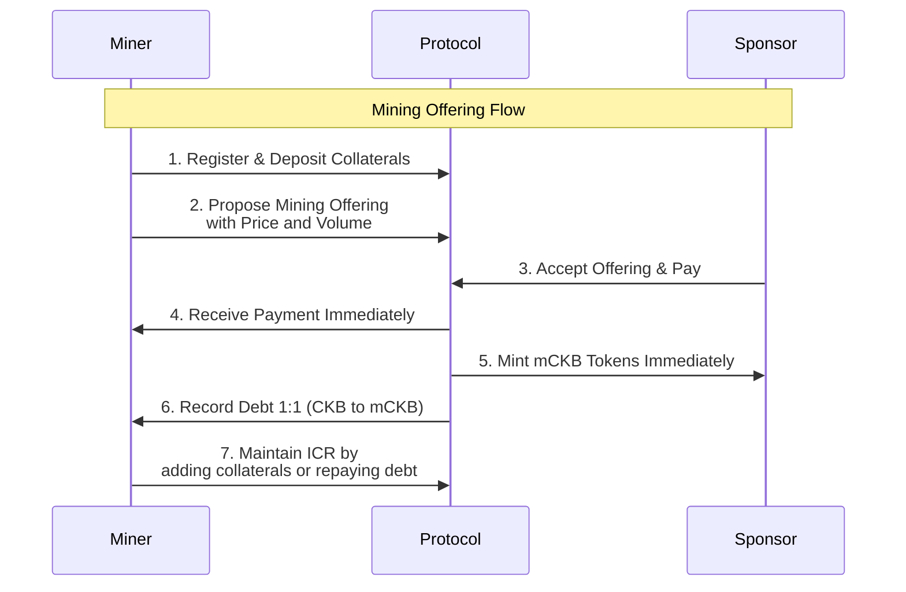
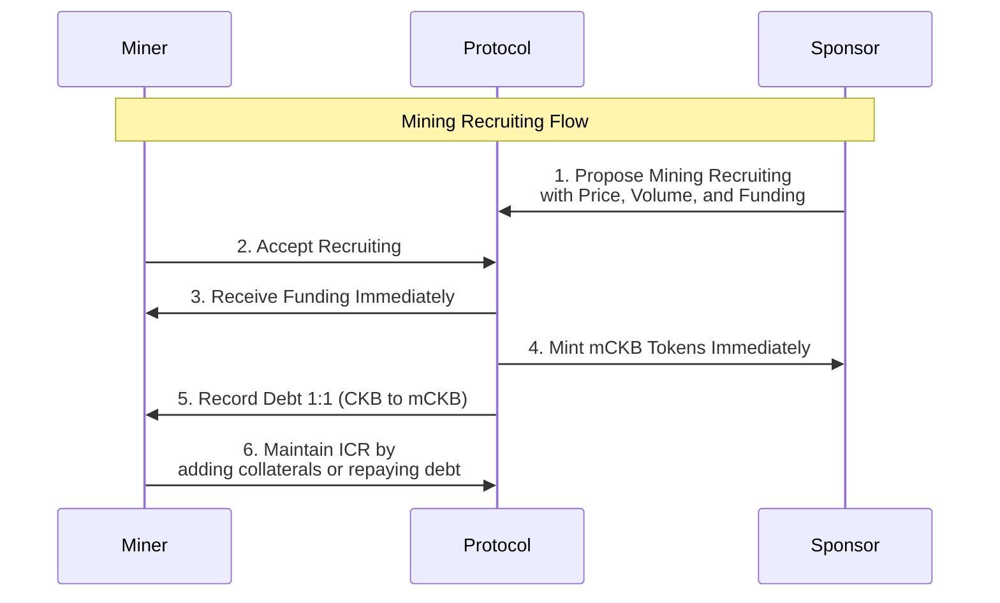

# Mining Schedules

## Mining Offering

## Mining Recruiting

- Miners can register as mining providers by depositing collaterals and keeping a liquidation deposit;
- After registration, mining provider can propose mining offering at its own price and volume to allow mining sponsors to mint mining contract tokens (e.g, mCKB):
  - Mining provider can set price in either CKB or stable coins against mCKB by absolute price or relative price;
  - Mining provider receives payments immediately; Mining sponsor receives mining contract tokens immediately;
  - Debt are recorded to Mining Provider in CKB 1:1 to mCKB;
  - Global fixed rates apply;
- The Mining provider maintains a secure Individual Collateral Ratio (ICR) by depositing enough collaterals against its debt or it will face liquidation;
- Similarly, mining sponsors can propose a mining recruiting at its own price and volume with funding to allow mining providers to mint mining contract tokens to the sponsor;
- Multi-level pricing.
- Balance based perpetual contract.
- Different tiers of fee: Different 0 interest span and different penalty rate.
